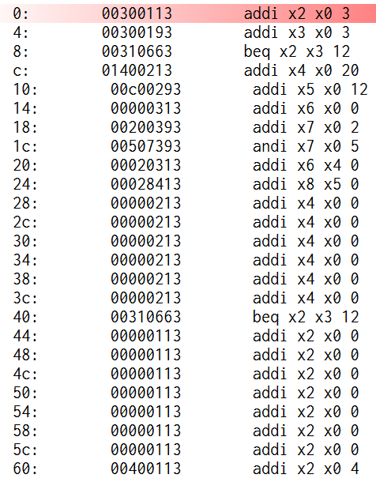
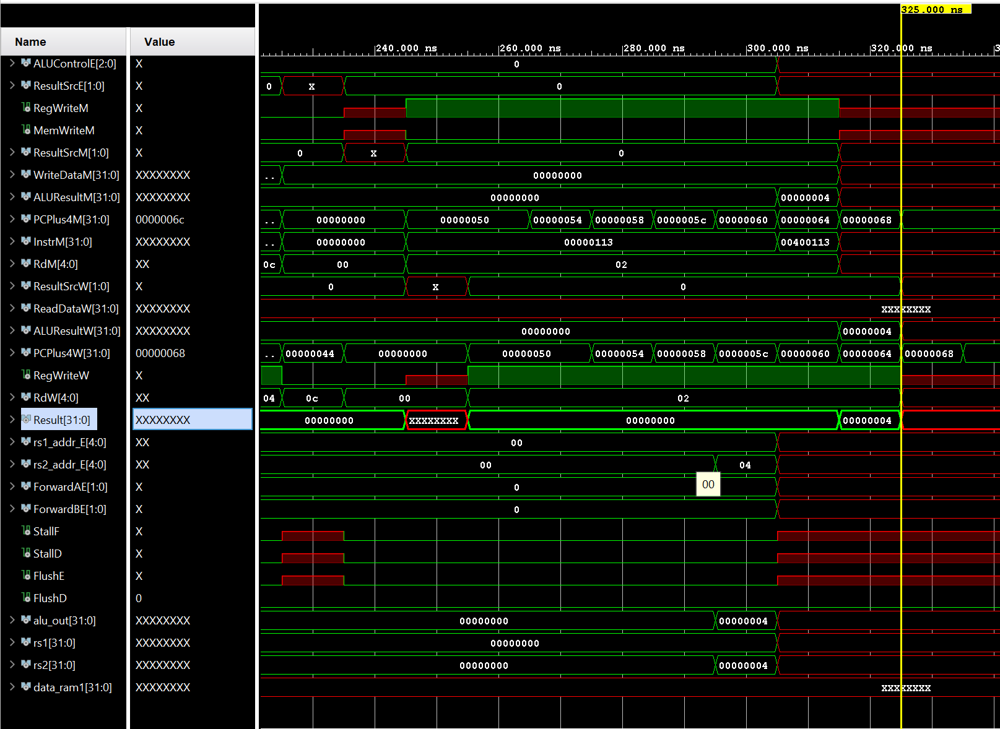
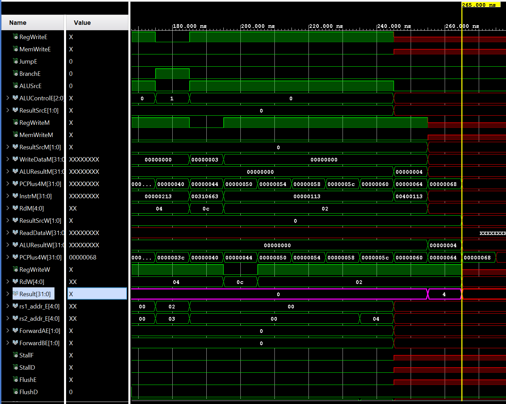

# 🚀 RISC_V_PIPELINE_CORE_BRANCH_PREDICTOR

An optimized **RISC-V RV32I** Pipeline CPU featuring **branch prediction**, built using **Verilog** and simulated in **Vivado 2023.1**.

Final Architecture  

---

## 📜 Table of Contents
- [📜 Table of Contents](#-table-of-contents)
- [📌 About the Project](#-about-the-project)
- [🛠️ Features](#️-features)
- [🧠 Instruction Set Architecture (ISA)](#-instruction-set-architecture-isa)
- [📂 Project Structure](#-project-structure)
- [⚡ Simulation Results](#-Simulation-Results)

---

## 📌 About the Project
This project implements a **5-stage pipelined RISC-V CPU** based on the **RV32I instruction set**, featuring a **branch predictor** to enhance performance. The pipeline consists of the following stages:

1️⃣ **Instruction Fetch (IF):** Fetches the instruction from memory.  
2️⃣ **Instruction Decode (ID):** Decodes the instruction and reads registers.  
3️⃣ **Execute (EX):** Performs arithmetic or logic operations.  
4️⃣ **Memory Access (MEM):** Reads from or writes to memory (if needed).  
5️⃣ **Write Back (WB):** Writes the result back to the register file.  

🚀 **Key Features:**  
✅ **5-stage pipelining** for improved instruction throughput.  
✅ **Branch prediction** to reduce stalls and improve performance.  
✅ **Hazard handling** for data and control dependencies.  
✅ **Optimized forwarding logic** to minimize stalls.  
✅ **Vivado testbench & waveform simulation** for verification.  

This CPU efficiently executes **RISC-V RV32I instructions**, making it a **high-performance single-cycle processor with enhanced pipelining and prediction mechanisms**.

## 🧠 Instruction Set Architecture (ISA)
The CPU supports **all major RV32I instruction formats**:

| Type  | Format          | Description |
|-------|---------------|-------------|
| **R-Type** | `rd, rs1, rs2` | Register-to-register operations |
| **I-Type** | `rd, rs1, imm` | Immediate operations & loads |
| **S-Type** | `rs1, rs2, imm` | Store instructions |
| **B-Type** | `rs1, rs2, label` | Branch instructions |
| **U-Type** | `rd, imm` | Upper immediate instructions |
| **J-Type** | `rd, label` | Jump instructions |

✔ **Full instruction list can be found [here](docs/instructions.md)**  

---

## 📂 Project Structure

    ├── docs/
    │   └── instructions.md
    └── src/
        ├── components/
        │   ├── adder.v
        │   ├── alu_decoder.v
        │   ├── alu.v
        │   ├── branching_unit.v
        │   ├── controller.v
        │   ├── ff.v
        │   ├── hazard_unit.v
        │   ├── imm.v
        │   ├── main_decoder.v
        │   ├── mux_2_1.v
        │   ├── muxx_4_1.v
        │   └── predict_handler.v
        ├── memory/
        │   ├── data_mem.v
        │   ├── instruction_memory.v
        │   └── reg_file.v
        ├── branch_predictor.v
        ├── decode_cycle.v
        ├── fetch_cycle.v
        ├── execute_cycle.v
        ├── memory_cycle.v
        ├── riscv_top.v
        └── writeback_cycle.v
## 🧪 Simulation Results

This project was simulated using **Vivado 2023.1**. We verified both the functional correctness and performance improvement brought by the 2-bit branch predictor.

---

### 📌 Sample Assembly Code

The following RISC-V assembly loop was used to test the branch predictor mechanism:

*Figure: Input Assembly Loop for Testing*

---

### 🔍 Without Branch Prediction

In the absence of a branch predictor, every `BEQ` instruction causes a pipeline flush due to misprediction. As a result:

- The CPU stalls frequently.
- Final output is obtained at **325 ns**.
  

*Figure: Waveform without Branch Predictor*

---

### 🚀 With 2-bit Branch Predictor

A 2-bit saturating counter with 4 states was implemented to improve branch prediction accuracy. With this, the CPU:

- Avoids pipeline flushing for predicted branches.
- Saves **60 ns** (3 cycles × 10 ns for each of the 2 correct predictions).
- Final output obtained at **265 ns**.

*Figure: Waveform with Branch Predictor*

---

### 📊 Observations

| Metric                       | Without Predictor | With Predictor |
|-----------------------------|-------------------|----------------|
| Branch Delay Penalty        | High              | Low            |
| Pipeline Flushes            | Frequent          | Minimal        |
| Final Execution Time        | 325 ns            | 265 ns         |
| Clock Period                | 10 ns             | 10 ns          |
| BEQ Instructions            | 2                 | 2              |
| Time Saved                  | 60 ns             | ✅             |

> ✅ The two-bit predictor enhances the CPU's performance by reducing the number of pipeline flushes during branch execution, thereby saving significant clock cycles.

---

### ✅ Conclusion

The simulation confirms that incorporating a **2-bit branch predictor** in a 5-stage pipelined RISC-V CPU significantly improves performance, especially in branch-intensive programs.
